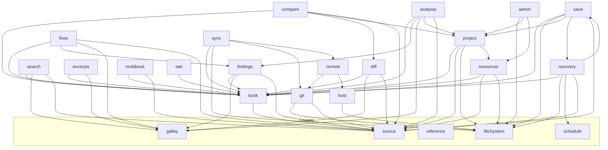

# Services at a glance

One section per service: what it is in plain words, what is wrong or constrained about it today, and where it could go. Depth lives in [`architecture/`](architecture/); each section links to its chapter. This page replaces the v2 module DAG and the slice plans in `planning/00-ideas`. The graph below was redrawn from real `src/core` imports on 2026-09-23.

**Keep it short.** A section that grows past a screen is a sign its detail belongs in the architecture chapter. When an item is fixed, delete it; when an idea gets serious, give it a plan in `planning/01-discussing` and leave a one-line pointer here.

## Where to focus (as of 2026-09-23)

1. **Location / references** — the next feature foundation. See [Location](#location-and-reference) and `planning/01-discussing/editor-primitives-consistency.md`.
2. **Git, top to bottom** — history time travel is next, and the pull/push/lifecycle flow needs one careful pass before anything else is added to it. See [Git](#git).
3. **One diff and sync model** — after the primitives settle: retire the line diff, stop reading and diffing every book, one change classification for History, Review and Cloud. See [Diff](#diff) and `planning/01-discussing/diff-and-sync-model-2026-09-23.md`.
4. **Data safety in Recovery** — a journal must know what text it started from. See [Recovery](#recovery).

## The graph

Arrows point at what a module imports. Every module also emits to Observability; that edge is omitted.

Above core: `src/editor` (CodeMirror; Book → EditorBook, the funnel, recipes) and `src/platform/{web,tauri,node}` (one Layer per host capability). Above those sits `src/app` (composition, commands, ProjectContext, stores, workflows, UI) with `src/routes`. `src/dev` is the design surface and never ships. [Boundaries](architecture/boundaries.md) is the enforced version of this.

Save ↔ Recovery is the one two-way pair: recovery reads the Baseline type, and save optionally asks for Recovery to clear a journal.

---

# Host

## HostInfo

### Overview

Tells the app which host it is on (Web or Tauri), the build identity, the locale, the app paths (appData, logs, journal) and a capability set (`nativeDisk`, `nativeGit`, `fsWatch`, `dialogs`, `secureStore`). `src/core/host/hostInfo.ts`, one implementation per host in `src/platform`. → [host](architecture/host.md)

### Constraints and known bugs

- None known.

### Ideas / future

- None.

## FileSystem

### Overview

The port is `effect/FileSystem` used as-is. Implementations: memory (tests, fixture), Node (tooling), OPFS (Web), Tauri fs plugin (desktop, the only one with a real `watch`). `writeFileAtomic`, `scopedTo` and a 17-law contract suite live in `src/core/fileSystem`. `nodeView` is the Node-shaped `fs` that isomorphic-git reads through. → [storage](architecture/storage.md)

### Constraints and known bugs

- Web cannot open a folder on the user's disk: `pickFolder` returns a handle name, not a path (`TODO(seam)` in `platform/web/dialogs.ts`).
- Web never calls `navigator.storage.persist()`, and nothing tells the user if the browser evicts storage.
- The Tauri implementation is not run against the contract suite (it needs a Tauri runtime).

### Ideas / future

- A Tauri journey that proves real IPC and a refusal outside the fs scope.

## Settings

### Overview

Schema-validated preferences persisted as JSON through `writeFileAtomic`. Each module registers its own keys and gets a token back; a bad value falls back to its default. `src/core/host/settings.ts`, `src/app/settings.ts`, the `/settings` route. → [host](architecture/host.md), [shell](architecture/shell.md)

### Constraints and known bugs

- Nothing calls the engine's `setSettings` yet; the first caller must invalidate the findings caches by hand.

### Ideas / future

- Git author name and email as a setting (see [Git](#git)).

## Credentials

### Overview

Tokens for remotes, never in project files. Web keeps them in `localStorage` keyed by endpoint origin; desktop keeps them in the OS keychain through Rust commands. The consumer is the Gitea account code. → [host](architecture/host.md), [git](architecture/git.md)

### Constraints and known bugs

- Desktop: the keychain `service` name comes from the webview rather than being fixed in Rust.

### Ideas / future

- None.

## Dialogs

### Overview

Open, save and folder pickers behind one port, with Web and Tauri implementations. `src/core/host/dialogs.ts`.

### Constraints and known bugs

- The Web folder pick is the same gap as in [FileSystem](#filesystem).

### Ideas / future

- None.

## Updater

### Overview

Desktop self-update: `core/host/updater.ts` (port), `platform/tauri/updater.ts`, the Cloudflare worker in `workers/sefer-updater`, and `UpdatePanel.tsx`. → [desktop](architecture/desktop.md), `workers/README.md`

### Constraints and known bugs

- The updater worker's custom-domain routes are still commented out (`workers/sefer-updater/wrangler.toml`). No tagged release has produced `.sig` assets yet.

### Ideas / future

- None.

## Observability

### Overview

A bounded ring of events, spans and verdicts, and a second ring of 200 for `failed`/`unavailable`/`refused` that ordinary work cannot evict. Every event is also written to a log directory on the device (OPFS on the Web, the app log directory on desktop): 256 KB JSONL parts, each opening with a session header, kept seven days and 5 MB. Settings → Advanced → Export diagnostics hands over one file: header and a project snapshot, the failure ring, the main ring and every part on disk, with string fields allowlisted and paths cut to their last segment. `failed` is the one alarm — a dev build prints each as a `console.error` — and `unavailable` is the world saying no. The dev surface is `__sefer.observability` (`traces.recent/print`, `logs.recent`, `errors`, `failures`, `export`, `level`, `setLevel`, `stream`). There is a dev-only OTLP bridge, and a keystroke meter in the editor. Client failures are `client.error` notes in every build. `src/core/observability.ts`, `src/core/diagnostics/`, `src/app/diagnostics.ts`, `src/platform/observability.ts`, `src/editor/observability.ts`. → [observability](architecture/observability.md)

### Constraints and known bugs

- Recording defaults to `all` in every build until the perf baseline says otherwise (`pnpm verify:perf`; numbers in `planning/01-discussing/logging-and-tracing.md`).
- The Web header has no OS version or architecture: a browser freezes both in its user agent. macOS's WKWebView reports no version either.
- The export allowlist (`STRING_KEYS` in `src/core/diagnostics/export.ts`) must be extended by hand when a producer adds a string attribute; until then that field exports as `"redacted"`.
- An OPFS append rewrites the whole part, which is why parts are 256 KB.
- `analysis.warm` is in the name union and nothing opens it.
- `sync.plan`, and the `unavailable` endings of `sync.transfer` and `import.remote`, have only been read against the in-memory fixture, which has no repository and no remote; they need a real Gitea to be seen end to end. `reference.pair` has not been seen either: it needs an empty block in the open book that the reference lacks.

### Ideas / future

- Correlate with Rust logs (`tauri-plugin-log`), if the Rust side ever needs it.
- A query layer in code, if the `jq` recipes in the observability doc get unwieldy.

---

# Engine

## Galley

### Overview

The pinned Scripture Kitchen WASM build (tagged git dependency, v0.1.6). Onion parses, Sous proofreads, and Galley composes both. It is one in-process synchronous handle: `analyze`, the corpus (`update`, `updateReference`, `publish`), `find`, `lint`, `toc`, `mask`, `diff`/`merge`, `formatEdits`, `skeleton`/`overlay`, `hash`. `src/core/galley`; loading happens in `src/platform/{web,node}/galley.ts`. → [galley](architecture/galley.md)

### Constraints and known bugs

- `Tree.spansIn`/`Tree.enclosing` (engine-ask 9) are available and unused: nothing yet needs a markup extent.
- Legacy `\s5` is not registered. v0.1.5 can treat it as a bare standalone marker (`setExtensions(…, { relaxZPrefix: true })`, once at composition; on en_ulb it takes lint from 19,849 findings to 812). Open: register for every project, or only ULB-derived ones? Stripping `\s5` from text is a separate choice.
- An unchanged Review row (no runs) still reads note prose joined to the word before it; only changed rows set notes apart.
- Still open upstream: the Sous character census (engine-asks 2) and chapter labels (engine-asks 4).

### Ideas / future

- `hash` (xxh3) is ready for Recovery's base check and Git's per-chapter cache. A chapter hash means hashing the chapter's slice; it cannot be derived from the book's.
- A Worker for whole-project analysis, only if a measurement asks for it.

## ProjectAnalysis

### Overview

Sefer's whole-project consumer of Galley. It analyses every book when a project opens and re-analyses on a debounce. It holds the cross-book results, reference texts and the character inventory, each stamped for freshness. `src/core/analysis/projectAnalysis.ts`. → [findings](architecture/findings.md), [inventory](architecture/inventory.md)

### Constraints and known bugs

- `attach` runs in the application scope, not a per-project one. A closed project's book subscriptions live until the app is disposed.
- Rejected books appear as a count ("N files did not become books"), not by name and reason.

### Ideas / future

- A per-project Scope that closes with the project.

---

# Text

## Source and Book

### Overview

Canonical UTF-8 text per book with a `SourceStamp {revision, length}`. Invalid UTF-8 is refused, and the dominant EOL/BOM is written back. A plain Book applies changes and returns a Receipt or a Refusal; the editor-backed Book continues the same revision. `src/core/source`, `src/core/book`. → [source](architecture/source.md)

### Constraints and known bugs

- A file refused as `InvalidUtf8` has no repair path: no safe view, no untouched export, no deliberate correction.

### Ideas / future

- None.

## Project

### Overview

A folder of books, with discovery (including RC `manifest.yaml` and Burrito metadata), the four book states (Unloaded, Plain, Instantiated, Failed), the seat (which book the editor holds), the project index and slugs. `src/core/project`. → [project](architecture/project.md)

### Constraints and known bugs

- Nothing calls `project.release`, so instantiated books are never evicted.
- Adding or removing a book while a project is open is `Unsupported`.

### Ideas / future

- One instantiated book, or an LRU of books that keep their undo history?
- When may an inactive book be evicted?

## Location and Reference

### Overview

Book codes, the canon table and a forgiving reference parser (`src/core/reference/{reference,canon}.ts`). It has no architecture chapter yet.

### Constraints and known bugs

- Two address types (`Reference` in reference.ts, `Ref` in book.ts).
- The rule: Sefer never scans for `\c`/`\v` with a regex or keeps its own diff; the engine's TOC and decision units answer. Four places still turn an offset into a verse on their own: search's `buildRefTable`/`refFrom`, Library's `CHAPTER` regex, the `showReference` scan in ProjectContext, and the findings/inventory exact-stamp + `toc.at`.

### Ideas / future

- **Next up:** a `src/core/location` module:
  - one address type
  - `parseNavigation` and a strict `matchProse`
  - `at`/`covering`/`resolve` over the TOC
  - an acceptance table: LUK 3:1, chapter-only, `\v 1-2`, a duplicate `\v`, front matter, stale analysis

  Every caller above moves onto it. Plan: `planning/01-discussing/editor-primitives-consistency.md`.

---

# Editing

## Editor

### Overview

CodeMirror over an EditorBook: the phases, registry, mapping and plan; one funnel for every write (`src/editor/funnel.ts`); undo; regular and USFM modes; chapter and book views; clip. `src/editor`, mounted by `app/ui/BookEditor.tsx`. → [editor](architecture/editor.md), [solid](architecture/solid.md)

### Constraints and known bugs

- The mode bundle (`assignment` + `modeFacet` + `editorAttributes`) is hand-built in three places: BookEditor, ExcerptEditor and `recipes/reference.ts`. `cmMode` is repeated across six files.
- Input and accessibility have not been exercised at all: no IME, RTL, screen-reader or keyboard-only evidence, in either mode or any of the three desktop webviews. Only groundwork exists (text direction, bidi isolates).

### Ideas / future

- One mode-bundle helper (in the editor-primitives plan).
- The input/a11y gate:
  - choose the target writing systems and IMEs
  - record evidence per mode and per webview
  - make a touch decision
- USFM-aware copy profiles, and the aligned-word tooltip (both in `planning/04-parked/parked.md`).

## Satellites

### Overview

Editable windows that own no text: they submit through the host book's funnel. This covers the footnote editor, the excerpt cards in Find and Key terms, and `recipes/satellite.ts`. The read-only reference pane (`recipes/reference.ts`) is deliberately not a satellite. → [editor](architecture/editor.md)

### Constraints and known bugs

- A satellite still dispatches its selection when `submit` refuses (`satellite.ts:175`).

### Ideas / future

- A reference preview or a comment anchor as the first multi-surface test, once Location exists.

## MultiBook

### Overview

One command across several books, with one history event per book and an undo that expires. Used today only by `format.project`. `src/core/multibook`. → [diff and multibook](architecture/diff-and-multibook.md)

### Constraints and known bugs

- None known.

### Ideas / future

- A labelled cross-book undo in the UI.

---

# Proofreading

## Findings (with Inventory)

### Overview

One `Finding` shape over engine diagnostics and project checks, with a semantic id and two stamps. Filters, the `/findings` panel, inline lint in the editor, and the `/inventory` character page. `src/core/findings`. → [findings](architecture/findings.md), [inventory](architecture/inventory.md)

### Constraints and known bugs

- The inventory only lists characters the engine made a claim about; it waits on the Sous census.
- Who localises rule messages is undecided.

### Ideas / future

- A severity legend (parked: `severityOf`).
- "Other places this character is flagged" (parked: `sitesOfGlyph`).
- A local numbering lint.
- Bulk fix.

## Fixes (format and source-match)

### Overview

Offered repairs applied through the Book, with a triple staleness check. Engine formatting per book and per project. "Match formatting" (the overlay) copies a source text's paragraphing onto the target, per chapter or per book, as one undo step. `src/core/fixes`, `src/core/galley/overlay.ts`. → [findings](architecture/findings.md), [stet](architecture/stet.md)

### Constraints and known bugs

- "Format" means engine formatting only. `format.match.*` and `overlay.book` should become one scoped source-match action with no preview. This is the naming pass in the fallow follow-ups.
- There is no chapter or range formatting.

### Ideas / future

- A settings surface for `FormatOpts`.
- Decide which fixes are safe without a preview.

---

# Find

## Search

### Overview

Project find over the reading text, in JavaScript over the engine's mask map (`findInReading`). Literal or regex, case and whole-word switches, stamped hits, and reference-project hits drawn beside the verse. Replace all sits behind the Advanced setting `find.enableReplaceAll`. `src/core/search`, the `/find` route. → [search](architecture/search.md)

### Constraints and known bugs

- A hit that spans markup cannot be replaced (`Stale`).
- `Hit.reading` is declared and never set; delete it next time search is touched.

### Ideas / future

- None.

## Excerpts

### Overview

The multibuffer shared by Find and Key terms: occurrences grouped into verse excerpts, with editable cards. `src/core/excerpts`, `src/app/ui/excerpts`.

### Constraints and known bugs

- Grouping is O(all findings) up front, about 80 ms. Parked in `planning/04-parked/one-liners.md`; the loading behaviour itself may change.

### Ideas / future

- None.

---

# Compare

## Diff

### Overview

There are two diffs today. The engine skeleton (decision units addressed by sid, `core/diff/skeleton.ts` + `core/galley/diff.ts`) feeds `/review`, and both its views mark words from the engine's located runs over the engine's reader text. A legacy line diff (`core/diff/diff.ts`) still feeds History hunks and Revert, `compareBooks`, and `projectSource.apply`. → [review](architecture/review.md), [diff and multibook](architecture/diff-and-multibook.md)

### Constraints and known bugs

- The line diff breaks the sid-aligned-only rule.
- `compareBooks` reads and line-diffs every book on both sides, untouched ones included, only to decide "identical" and count hunks, which Review no longer shows. Nothing is skipped by stamp.

### Ideas / future

- The plan: `planning/01-discussing/diff-and-sync-model-2026-09-23.md`. Skip by stamp, read only changed books, one change classification shared by History, Review and Cloud, then move History, `compareBooks` and `projectSource` onto decision units and delete `core/diff/diff.ts`.
- The diff UI redesign is paused on `/project/$slug/playground`.
- **Default baseline: the file on disk against the working session, not the last commit.**

## Review

### Overview

The one compare screen, `/review`. Both sides are pickers over a `CompareSource` (the working project, a folder, a zip, a recorded version, or the saved file). You decide per unit, then Apply, and Record a version (save + commit). The icon rail's Compare tile opens it. `src/core/compare`, `src/app/ui/review`. → [review](architecture/review.md)

### Constraints and known bugs

- The flow itself needs design work.
- The copy says "Save & Review" and stays that way until the product-copy pass.

### Ideas / future

- Its own `/compare` route again, some day, if the flow splits.

---

# Durable

## Save and Baseline

### Overview

**Only Save writes a book to disk.** Everything else is a journal of the dirty buffer, so the app is not constantly writing files the way Zed or VS Code do, which would fight with Git. The SaveCoordinator does snapshot-bound writes with a per-path lock, a receipt and a Baseline, and `dirty` is decided by revision and hash. `src/core/save`. → [review §4](architecture/review.md)

### Constraints and known bugs

- `externalChanges`/`resolve` exist but nothing calls them, and Web has no `watch`. Something changing a file under OPFS or the sandbox mid-session is unlikely, but not impossible.
- There is no disk-identity check at save time.
- Partial `saveAll` failures have no user-facing report.

### Ideas / future

- If external change proves real: a conflict prompt (keep mine / take disk / compare).

## Recovery

### Overview

A JSONL journal of edits to the dirty buffer, debounced and compacted. On open, `pendingOnOpen` checks against disk and a banner offers Restore all / Discard all. It is the only automatic write. `src/core/recovery`, `app/ui/recovery`. → [recovery](architecture/recovery.md)

### Constraints and known bugs

- **Data safety:**
  - `restore` replays onto whatever text the book has now, with no check that it is the text the journal started from.
  - One bad or truncated line marks the whole journal `Corrupt`, and it is skipped silently. So is an unknown version.
- `recovery.attach` runs on every window focus and adds a subscription each time, in the application scope.
- No retention cap, no quota response, and no flush on `pagehide` (up to 500 ms of edits lost on a tab close).

### Ideas / future

- Record the starting text's hash (`GalleyService.hash`) at the head of each journal. On load, replay the `[from, to)` changes forward only when the base matches. Recover the valid prefix of a damaged journal and say so.

## Git

### Overview

One port answered by isomorphic-git over OPFS on Web and git2 through Rust commands on desktop: commit, log, show, `previousVersions`, branch, resolve, `changedPathsBetween`, `moveBranch`, `abortMerge`. History is a list of versions with a diff against working and a per-hunk Revert. `src/core/git`, `src-tauri/src/git.rs`. → [git](architecture/git.md), [desktop](architecture/desktop.md)

### Constraints and known bugs

The flow needs one top-to-bottom pass before more is added.

- Desktop pull (`git.rs:776`) force-checks-out the incoming tree and does not first look for uncommitted changes on disk. Under explicit save the "uncommitted change" is usually a saved-but-unrecorded book, and it would be overwritten.
- Desktop push has no rejection callback: a push the server refuses (for example, not a fast-forward) can look like success.
- The commit author is hard-coded as `Sefer <sefer@localhost>` in three places.
- There is no repository lifecycle (absent / busy / unhealthy / closing), and mutations are not serialised against each other.
- Web `previousVersions` walks the whole log with no `depth`.

### Ideas / future

- **Next up:** book time travel: a read-only historical pane with previous/next, and a bounded log. Then chapter filtering via Location, with a per-(blob, chapter) hash cache and an LRU. Plan: `planning/01-discussing/next-git-considerations.md`, which folds into the diff and sync model.
- Detect Git changes made outside Sefer; add "back to latest" and an unhealthy-repository recovery flow.

---

# Online

## Remote

### Overview

Clone, fetch, pull, push and branch moves against a Gitea (WACS) server, plus the Gitea account half (sign-in, tokens). `src/core/remote`, `platform/{web,tauri}/remote.ts`. → [git](architecture/git.md), [configuration](architecture/configuration.md)

### Constraints and known bugs

- Desktop transfer progress is a `TODO(seam)` (`platform/tauri/remote.ts:141`).
- Desktop `git_clone` (git2 `RepoBuilder`) compiles but has not been run against a server; the web clone was checked on `main` and `master` repositories through the prod proxy.
- The dev channel has no WACS Language API URL yet (`tools/deploy/channels.ts:67`). Onboarding and project loading on dev can't reach it.

### Ideas / future

- None.

## Sync

### Overview

The `/cloud` screen. It reads the two clocks and sorts the project into one of nine states, plans what a Receive would change, and Combines. Scripture text is never merged automatically. `src/core/sync`, `app/ui/cloud`. → [sync](architecture/sync.md)

### Constraints and known bugs

- A contested book's link opens Review for the project, not that book: Review takes no book in its URL.

### Ideas / future

- None.

## Catalogue

### Overview

Browsing the online catalogue on the landing screens. One `catalogue.browse` operation per load of the table: a Language API that is down or answers non-2xx ends `unavailable`, a payload the decoder cannot read `failed`. `src/app/catalogue.ts`. → [landing](architecture/landing.md)

### Constraints and known bugs

- None.

### Ideas / future

- None.

---

# Resources

## Import

### Overview

Staged, validated import with provenance (`stage` → `classify` → `commit`, `.sefer/provenance.json`, `via` zip or folder; a clone appends a `remote` record, `src/core/project/provenance.ts`). Every arrival then writes its projects-index row at once, `from` included. Web intake takes a folder or a zip. `src/core/resources/import.ts`, `platform/web/intake.ts`, `ImportHub.tsx`. → [resources](architecture/resources.md), [landing](architecture/landing.md)

### Constraints and known bugs

- Zip intake does not reject `..` or absolute entry paths.
- Duplicate book ids are refused only later, at open, not at commit.

### Ideas / future

- Web Translation Notes import: pack per book straight from the zip entries, validate, then publish to the Library (`planning/01-discussing/web-translation-notes-import.md`).
- Cleanup of an import stage abandoned when the process dies.

## Library

### Overview

Stable resource identities bound to project roles (`source`, `reference`, `tn`, `tw`, `tq`). The read-only reference pane with caret-driven block pairing. `src/core/resources/library.ts`, `app/workflows/references.ts`, `ReferencePane.tsx`. → [resources](architecture/resources.md)

### Constraints and known bugs

- Scripture only: a `tn`/`tw` binding can be made, but nothing reads it.
- No UI for recovering a missing binding.

### Ideas / future

- A Translation Notes reader and pane.
- The key-terms guide as a Library resource instead of a fixture.

## ProjectAdmin

### Overview

Rename, delete, archive, export, metadata and checksum refresh. `src/core/admin/projectAdmin.ts`, `app/projectCommands.ts`, `YourProjects.tsx`. → [git](architecture/git.md), [landing](architecture/landing.md)

### Constraints and known bugs

- There is no `create`: the Create flow stops before writing anything (`CreateProject.tsx`).
- `updateMetadata` has no UI.
- Delete removes the folder with no trash, and does not check shared-library use.

### Ideas / future

- Decide what an empty new project contains.
- Decide whether export takes the working text or the saved bytes.

---

# Shell

## Shell

### Overview

Composed exactly once (`composeApplication`), with services reached through `useComposition()`. It covers the command registry with `when()`, the routes under `/project/$slug/…`, ProjectContext, and event → core → stores. `src/app`, `src/routes`. → [shell](architecture/shell.md), [composition](architecture/composition.md)

### Constraints and known bugs

- Localisation: `t` is an identity function (`src/app/i18n.ts`). No i18n library has been chosen.

### Ideas / future

- Lingui, with the catalogue chosen from `HostInfo.locale()`.
- A service worker so the Web app can cold-start offline.
- Generate the Tauri command bindings (tauri-specta) once there are about 30 commands (23 today) or a second person edits `git.rs`.

## UI layer

### Overview

Tailwind over semantic tokens, a primitives inventory, and corvu only inside `primitives/`. → [ui](architecture/ui.md), [design surface](architecture/design.md)

### Constraints and known bugs

- None known.

### Ideas / future

- A metadata page, View/Plain modes, mobile, reveal in the file explorer, system fonts, print.

---

# Workflows

## Key terms (STET)

### Overview

`/terms`: a frozen key-terms catalogue behind `StetCatalog`, with a committed guide fixture mapped onto the project's verses and shown as excerpts. `src/core/stet`, `app/workflows/stet.ts`. → [stet](architecture/stet.md)

### Constraints and known bugs

- The guide is a fixture.
- The "done" count is always 0, because nothing stores it across a reload.

### Ideas / future

- The guide as a Library resource.

## Drafting

### Overview

Not built. `src/app/workflows/drafting.ts` is an unwired stub (`Effect.die`) sketching a "drafting job": pick the source text from the Library, choose books and chapters, and draft each chunk through the funnel, with progress read from the census.

### Constraints and known bugs

- It waits on Location and on a form design that has not been settled.

### Ideas / future

- The v1 Form / body-editing job, re-audited.

## Commenting and discussion

### Overview

Not built. Threads anchored to scripture, shared through an outbox. Plan: `planning/01-discussing/commenting-and-discussion.md`.

### Constraints and known bugs

- Depends on Location (anchor mapping).
- Five owner decisions are open: visibility of unsaved text, invitation back-visibility, per-thread audience, revocation/fork policy, and the durable key for a Review unit.

### Ideas / future

- First proof: two offline clients, one book.

---

# Cross-cutting (no single owner)

- **Release:** a written platform/webview/IME matrix, a v1 parity ledger, and a migration decision. → the [release channels](../agents/skills/release-channels/SKILL.md) skill
- **Performance:** commit one large fixture, and record one baseline (keystroke tail, plus WASM and JS memory across book switches).
- **Desktop hardening:** a CSP (today `csp: null`), and a narrower fs scope than `$HOME/**`. → [desktop](architecture/desktop.md)
- **Dev fixture:** a Tauri half (seed a temp dir on native disk). `__sefer.state()` could also report the current, saved and analysis revisions and recent failures. → [verification](agents/verification.md)
- The rules every module keeps are in [INVARIANTS](INVARIANTS.md).
