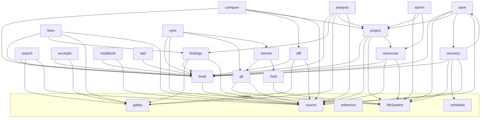

# Services at a glance

One section per service: what it is in plain words, what is wrong or constrained about it today, and where it could go. Depth lives in [`architecture/`](architecture/); each section links to its chapter. This page replaces the v2 module DAG and the slice plans in `planning/00-ideas`. The graph below was redrawn from real `src/core` imports on 2026-09-23.

**Keep it short.** A section that grows past a screen is a sign its detail belongs in the architecture chapter. When an item is fixed, delete it; when an idea gets serious, give it a plan in `planning/01-discussing` and leave a one-line pointer here.

## Where to focus (as of 2026-09-25)

1. **Location** — done: every place question goes through Citation, Address and Location over the engine's TOC, and no regex reads a designator. Anchors (for comments) are the next piece, when comments start. See [Location](#location-and-reference) and [the Location chapter](architecture/location.md).
2. **Git, top to bottom** — history time travel is next, and the pull/push/lifecycle flow needs one careful pass before anything else is added to it. See [Git](#git).
3. **One diff and sync model** — after the primitives settle: stop reading every book (the line diff is retired, 2026-09-27), one change classification for History, Review and Cloud. See [Diff](#diff) and `planning/01-discussing/diff-and-sync-model-2026-09-23.md`.
4. **Data safety in Recovery** — a journal must know what text it started from. See [Recovery](#recovery).

## The graph

Arrows point at what a module imports. Every module also emits to Observability; that edge is omitted.

```mermaid
flowchart TB
  subgraph leaf [Leaves]
    source[source]
    fileSystem[fileSystem]
    reference[reference]
    schedule[schedule]
    galley[galley]
  end
  book[book] --> source
  project[project] --> book & source & fileSystem & resources
  resources[resources] --> book & source & fileSystem
  findings[findings] --> book & galley & source
  analysis[analysis] --> book & findings & galley & project & source
  fixes[fixes] --> book & findings & galley & source
  search[search] --> book & galley & source
  excerpts[excerpts] --> book & galley
  diff[diff] --> book & galley & source
  compare[compare] --> book & diff & project & source
  multibook[multibook] --> book & source
  stet[stet] --> book
  save[save] --> book & fileSystem & project & recovery & source
  recovery[recovery] --> book & fileSystem & save & schedule & source
  git[git] --> fileSystem & source
  remote[remote] --> git & host
  sync[sync] --> book & fileSystem & git & remote
  admin[admin] --> fileSystem & project & resources
  host[host] --> fileSystem
```

Above core: `src/editor` (CodeMirror; Book → EditorBook, the funnel, recipes) and `src/platform/{web,tauri,node}` (one Layer per host capability). Above those sits `src/app` (composition, commands, ProjectContext, stores, workflows, UI) with `src/routes`. `src/dev` is the design surface and never ships. [Boundaries](architecture/boundaries.md) is the enforced version of this.

Save ↔ Recovery is the one two-way pair: recovery reads the Baseline type, and save optionally asks for Recovery to clear a journal.

---

# Host

## HostInfo

### Overview

Tells the app which host it is on (Web or Tauri), the build identity, the locale, the app paths (appData, logs, journal) and a capability set (`nativeDisk`, `nativeGit`, `fsWatch`, `dialogs`, `secureStore`). `src/core/host/hostInfo.ts`, one implementation per host in `src/platform`. → [host](architecture/host.md)

### Constraints and known bugs

- None known.

### Ideas / future

- None.

## FileSystem

### Overview

The port is `effect/FileSystem` used as-is. Implementations: memory (tests, fixture), Node (tooling), OPFS (Web), Tauri fs plugin (desktop, the only one with a real `watch`). `writeFileAtomic`, `scopedTo` and a 17-law contract suite live in `src/core/fileSystem`. `nodeView` is the Node-shaped `fs` that isomorphic-git reads through. → [storage](architecture/storage.md)

### Constraints and known bugs

- Web cannot open a folder on the user's disk: `pickFolder` returns a handle name, not a path (`TODO(seam)` in `platform/web/dialogs.ts`).
- Web never calls `navigator.storage.persist()`, and nothing tells the user if the browser evicts storage.
- The Tauri implementation is not run against the contract suite (it needs a Tauri runtime).

### Ideas / future

- A Tauri journey that proves real IPC and a refusal outside the fs scope.

## Settings

### Overview

Schema-validated preferences persisted as JSON through `writeFileAtomic`. Each module registers its own keys and gets a token back; a bad value falls back to its default. Writes go one at a time (a one-permit `Semaphore` across snapshot, save and publish): overlapping `set`s used to each save a file missing the other's key, and opening a project — three keys at once — lost its slug, so a reload found no project. `src/core/host/settings.ts`, `src/app/settings.ts`, the `/settings` route. → [host](architecture/host.md), [shell](architecture/shell.md)

### Constraints and known bugs

- Nothing calls the engine's `setSettings` yet; the first caller must invalidate the findings caches by hand.

### Ideas / future

- Git author name and email as a setting (see [Git](#git)).

## Credentials

### Overview

Tokens for remotes, never in project files. Web keeps them in `localStorage` keyed by endpoint origin; desktop keeps them in the OS keychain through Rust commands. The consumer is the Gitea account code. → [host](architecture/host.md), [git](architecture/git.md)

### Constraints and known bugs

- Desktop: the keychain `service` name comes from the webview rather than being fixed in Rust.

### Ideas / future

- None.

## Dialogs

### Overview

Open, save and folder pickers behind one port, with Web and Tauri implementations. `src/core/host/dialogs.ts`.

### Constraints and known bugs

- The Web folder pick is the same gap as in [FileSystem](#filesystem).

### Ideas / future

- None.

## Updater

### Overview

Desktop self-update: `core/host/updater.ts` (port), `platform/tauri/updater.ts`, the Cloudflare worker in `workers/sefer-updater`, and `UpdatePanel.tsx`. → [desktop](architecture/desktop.md), `workers/README.md`

### Constraints and known bugs

- The updater worker's custom-domain routes are still commented out (`workers/sefer-updater/wrangler.toml`). No tagged release has produced `.sig` assets yet.

### Ideas / future

- None.

## Observability

### Overview

A bounded ring of events, spans and verdicts, and a second ring of 200 for `failed`/`unavailable`/`refused` that ordinary work cannot evict. Every event is also written to a log directory on the device (OPFS on the Web, the app log directory on desktop): 256 KB JSONL parts, each opening with a session header, kept seven days and 5 MB. Settings → Advanced → Export diagnostics hands over one file: header and a project snapshot, the failure ring, the main ring and every part on disk, with string fields allowlisted and paths cut to their last segment. `failed` is the one alarm — a dev build prints each as a `console.error` — and `unavailable` is the world saying no. The dev surface is `__sefer.observability` (`traces.recent/print`, `logs.recent`, `errors`, `failures`, `export`, `level`, `setLevel`, `stream`). There is a dev-only OTLP bridge, and a keystroke meter in the editor. Client failures are `client.error` notes in every build. `src/core/observability.ts`, `src/core/diagnostics/`, `src/app/diagnostics.ts`, `src/platform/observability.ts`, `src/editor/observability.ts`. → [observability](architecture/observability.md)

### Constraints and known bugs

- Recording defaults to `all` in every build: the `pnpm verify:perf` baseline (in [observability](architecture/observability.md#levels)) measured no cost on the keystroke tail. The cost is volume, about 750 KB a minute of continuous typing, which makes the 5 MB disk window roughly half an hour of real editing.
- The Web header has no OS version or architecture: a browser freezes both in its user agent. macOS's WKWebView reports no version either.
- The export allowlist (`STRING_KEYS` in `src/core/diagnostics/export.ts`) must be extended by hand when a producer adds a string attribute; until then that field exports as `"redacted"`.
- An OPFS append rewrites the whole part, which is why parts are 256 KB.
- `analysis.warm` is in the name union and nothing opens it.
- `sync.plan`, and the `unavailable` endings of `sync.transfer` and `import.remote`, have only been read against the in-memory fixture, which has no repository and no remote; they need a real Gitea to be seen end to end. `reference.pair` has not been seen either: it needs an empty block in the open book that the reference lacks. Nor has `update.install`, or writing to the desktop log directory: both need the desktop build.

### Ideas / future

- Correlate with Rust logs (`tauri-plugin-log`), if the Rust side ever needs it.
- A query layer in code, if the `jq` recipes in the observability doc get unwieldy.

---

# Engine

## Galley

### Overview

The pinned Scripture Kitchen WASM build (tagged git dependency, v0.1.7). Onion parses, Sous proofreads, and Galley composes both. It is one in-process synchronous handle: `analyze`, `setExtensions` (the process-wide marker table), the corpus (`update`, `updateReference`, `publish`), `find`, `lint`, `toc`, `mask`, `diff`/`merge`, `formatEdits`, `skeleton`/`overlay`, `hash`. `src/core/galley`; loading happens in `src/platform/{web,node}/galley.ts`. → [galley](architecture/galley.md)

### Constraints and known bugs

- `Tree.spansIn`/`Tree.enclosing` (engine-ask 9) are available and unused: nothing yet needs a markup extent.
- `setExtensions` is process-wide: the marker table a project opens with is the one every parse reads until the next open — reference texts, review sides and loose parses included. Legacy `\s5` is registered as `standalone` only for a project whose texts already contain it (the policy table is `LEGACY_MARKERS` in `src/app/legacyMarkers.ts`; empty means nothing registered); opening a project without it clears the registration. en_ulb: 20,353 findings → 1,316. Detection is the one deliberate regex over markup, because it must run before the first parse. Stripping `\s5` from text is a separate choice. → [galley](architecture/galley.md#the-marker-table-setextensions)
- Still open upstream: the Sous character census (engine-asks 2) and chapter labels (engine-asks 4).
- Not yet asked: an unknown marker closes its paragraph at the end of its line (the recovery `\s5` caused before it was registered). The editor treats unknown markers as passthrough, and for the paragraph to flow through one the engine would have to leave it open, as it does for a registered standalone.

### Ideas / future

- `hash` (xxh3) is ready for Recovery's base check and Git's per-chapter cache. A chapter hash means hashing the chapter's slice; it cannot be derived from the book's.
- A Worker for whole-project analysis, only if a measurement asks for it.

## ProjectAnalysis

### Overview

Sefer's whole-project consumer of Galley. It analyses every book when a project opens and re-analyses on a debounce. It holds the cross-book results, reference texts and the character inventory, each stamped for freshness. `src/core/analysis/projectAnalysis.ts`. → [findings](architecture/findings.md), [inventory](architecture/inventory.md)

### Constraints and known bugs

- `attach` runs in the application scope, not a per-project one. A closed project's book subscriptions live until the app is disposed.
- Rejected books appear as a count ("N files did not become books"), not by name and reason.

### Ideas / future

- A per-project Scope that closes with the project.

---

# Text

## Source and Book

### Overview

Canonical UTF-8 text per book with a `SourceStamp {revision, length}`. Invalid UTF-8 is refused, and the dominant EOL/BOM is written back. A plain Book applies changes and returns a Receipt or a Refusal; the editor-backed Book continues the same revision. `src/core/source`, `src/core/book`. → [source](architecture/source.md)

### Constraints and known bugs

- A file refused as `InvalidUtf8` has no repair path: no safe view, no untouched export, no deliberate correction.

### Ideas / future

- None.

## Project

### Overview

A folder of books, with discovery (including RC `manifest.yaml` and Burrito metadata), the four book states (Unloaded, Plain, Instantiated, Failed), the seat (which book the editor holds), the project index and slugs. `src/core/project`. → [project](architecture/project.md)

### Constraints and known bugs

- Nothing calls `project.release`, so instantiated books are never evicted.
- Adding or removing a book while a project is open is `Unsupported`.

### Ideas / future

- One instantiated book, or an LRU of books that keep their undo history?
- When may an inactive book be evicted?

## Location and Reference

### Overview

What a typed place means and where a place is in one text. `src/core/location`: `address.ts` (the Address union: book, intro, chapters, verses; U23003 spelling), `names.ts` (the name catalogue: canon, project names, abbreviations, intro words), `citation.ts` (the Citation parser, navigation and prose grammars; the one Sefer file with a test), `locate.ts` (`resolve` and `addressAt` over a `TocView`), `canon.ts`. `src/core/galley/location.ts` adapts the engine's dish TOC into a `TocView`. `src/app/location.ts` is the per-project piece the shell exposes as `shell.location`: the catalogue memo, the held books, and the display rule (the project's own book name, English otherwise). → [location](architecture/location.md)

On it today: the palette, the sidebar's filter (`shell.location.books` for every book the words could mean, `read` for the chapter) and its chapter tiles (the engine's TOC from the held analysis, never a scan of the text), `showReference` (found / missing with its chapter / ambiguous, each reported), the inventory's site labels, the Key terms source card (Library's text through the engine), the sync plan's chapter rows, Search's hit Addresses (`addressAt` over an analysis the caller supplies), and Excerpts: each card's Address and label, and Key terms' and Find-in-references' mapping onto the project (`refOccurrences`, through `resolve`).

### Constraints and known bugs

- One address type: `Address`. `Ref` is gone from book.ts; `TermOccurrence`, `Hit`, `ReferenceHit` and `Excerpt` carry an Address. (`citation.ts` has a private token type of the same name; it is the parser's, not an address.)
- The rule: Sefer never scans for `\c`/`\v` (or `\h`, `\toc2`) with a regex; the engine answers. No place in Sefer outside the editor does any more. A book's own name is `bookHeading` (`core/galley/analysis.ts`), off the engine's tokens; the display rule (`shell.location.label`, `bookName`) is project name, then that heading when the caller holds a parse, then English.
- Kitchen v0.1.7 carries segments, verse-list members and each designator's label span in the TOC. Sefer's seam (`tocViewOf`) reads a verse label's end (the STET source card skips the number with it) and the members, kept only on a verse whose hull does not say what it covers — a list or a segment — so a plain book carries no array per verse. `resolve` honours them: `3a` finds `\v 3a` exactly and is `coarser` only when the text has plain `\v 3`; `3` over `\v 3a` … `\v 3b` finds both; `2` is missing from `\v 1,3,5`. Known and deliberate: `addressAt` inside `\v 1,3,5` says `1-5`, the hull — an Address is one range, and the hull leaves out nothing the caret is in; `resolve` is what refuses the holes. The label's START is not read yet; nothing needs it.

### Ideas / future

- The second pass is done (Search, Excerpts/STET, Library, the sync plan). Search took the lean, not the stale-TOC variant: a book being typed in gets hits without an Address rather than labels from the last published TOC, which costs nothing visible because cards label themselves from their own analysis.
- The palette and sidebar still name a book without its heading (they hold no parse); a project with no metadata names and a non-English `\h` reads English there and native on Find cards.
- A prose scanner for comments, when comments exist. The grammar is already in `citation.ts`.

---

# Editing

## Editor

### Overview

CodeMirror over an EditorBook: the phases, registry, mapping and plan; one funnel for every write (`src/editor/funnel.ts`); undo; regular and USFM modes; chapter and book views; clip. A projection on a surface is one extension, `modeView(name, surface?)` (`views.ts`). `src/editor`, mounted by `app/ui/BookEditor.tsx`. → [editor](architecture/editor.md), [solid](architecture/solid.md)

### Constraints and known bugs

- In headless Chromium and headless Chrome, CodeMirror's `posAtCoords` on the fixture's Psalms answers a position one to three visual lines below the point it is given (master as well as today), so a scripted click, and End (which finds the line's end by coordinates), land low. Not seen in a real window; scripted checks dispatch the selection a click would make instead.
- Passthrough markers (a registered standalone such as `\s5`, and any unknown marker) are invisible in regular mode and immortal: the caret goes around them, no key takes one alone, and a delete that covers one takes it — the matrix's immortal rule; a `KEEP` bit that wrote around them instead was tried and dropped because it glued `\s5` to the next word. The space a paragraph shows where it flows through blank and `\s5` lines is the registry's `join` set, which owns those lines, so Backspace or Delete at it removes the whole gap in one step. → [editor](architecture/editor.md#passthrough-markers)
- An unknown marker closes its paragraph in the engine at the end of its line, so unlike `\s5` the paragraph does not flow through it: the marker is invisible, the lines after it read as their own lines. Needs an engine answer (see Galley).
- Input and accessibility have not been exercised at all: no IME, RTL, screen-reader or keyboard-only evidence, in either mode or any of the three desktop webviews. Only groundwork exists (text direction, bidi isolates).

### Ideas / future

- The input/a11y gate:
  - choose the target writing systems and IMEs
  - record evidence per mode and per webview
  - make a touch decision
- USFM-aware copy profiles, and the aligned-word tooltip (both in `planning/04-parked/parked.md`).

## Satellites

### Overview

Editable views over one range of a book that own no text: they submit through the host book's funnel, and the Book judges each edit with its own phases under the satellite's terms (projection, mode, range, gesture) — nothing is trusted, and nothing outside the range is accepted however the edit arrives. A satellite settles its caret with the book's own settlement and motion keys, bounded by its range, and its typing undoes in the same steps as the book's. This covers the footnote editor (`note-satellite` projection), the excerpt cards in Find and Key terms, and `recipes/satellite.ts`. The read-only reference pane (`recipes/reference.ts`) is deliberately not a satellite. → [editor](architecture/editor.md#satellites-borrow)

### Constraints and known bugs

- Judging costs a plan and paint index under the surface's projection per edit (~0.3 ms on the fixture), on top of the canonical state's own.

### Ideas / future

- A reference preview or a comment anchor as the first multi-surface test, once Location exists.

## MultiBook

### Overview

One command across several books, with one history event per book and an undo that expires. Used today only by `format.project`. `src/core/multibook`. → [diff and multibook](architecture/diff-and-multibook.md)

### Constraints and known bugs

- None known.

### Ideas / future

- A labelled cross-book undo in the UI.

---

# Proofreading

## Findings (with Inventory)

### Overview

One `Finding` shape over engine diagnostics and project checks, with a semantic id and two stamps. Filters, the `/findings` panel, inline lint in the editor, and the `/inventory` character page. `src/core/findings`. → [findings](architecture/findings.md), [inventory](architecture/inventory.md)

### Constraints and known bugs

- The inventory only lists characters the engine made a claim about; it waits on the Sous census.
- Who localises rule messages is undecided.

### Ideas / future

- A severity legend (parked: `severityOf`).
- "Other places this character is flagged" (parked: `sitesOfGlyph`).
- A local numbering lint.
- Bulk fix.

## Fixes (format and source-match)

### Overview

Offered repairs applied through the Book, with a triple staleness check. Engine formatting per book and per project. "Match formatting" (the overlay) copies a source text's paragraphing onto the target, per chapter or per book, as one undo step. `src/core/fixes`, `src/core/galley/overlay.ts`. → [findings](architecture/findings.md), [stet](architecture/stet.md)

### Constraints and known bugs

- "Format" means engine formatting only. `format.match.*` and `overlay.book` should become one scoped source-match action with no preview. This is the naming pass in the fallow follow-ups.
- There is no chapter or range formatting.

### Ideas / future

- A settings surface for `FormatOpts`.
- Decide which fixes are safe without a preview.

---

# Find

## Search

### Overview

Project find over the reading text, in JavaScript over the engine's mask map (`findInReading`). Literal or regex, case and whole-word switches, stamped hits, and reference-project hits drawn beside the verse. Replace all sits behind the Advanced setting `find.enableReplaceAll`. `src/core/search`, the `/find` route. → [search](architecture/search.md)

### Constraints and known bugs

- A hit that spans markup cannot be replaced (`Stale`).
- A hit's `address` is there only when the caller's analysis describes exactly the scanned text (`Options.analysisOf`); otherwise it is absent. There is no fallback scanner. A bound reference is parsed once per exact text by `/find`, on its first hit.
- `Hit.projected` is declared and never set; delete it next time search is touched.

### Ideas / future

- None.

## Excerpts

### Overview

The multibuffer shared by Find, Key terms and Findings: occurrences grouped by TOC unit into cards, each a read-only view of the book in the editor's own projection that becomes a satellite on Edit or double-click. `src/core/excerpts`, `src/app/ui/excerpts`, `src/editor/recipes/reader.ts`. → [search](architecture/search.md#excerpts) The card being edited is PINNED where it stood (`multibuffer/CardList`, shared with Review; the frame and the editor are `CardFrame` and `CardEditor`): the screen re-takes its results at each pause in typing, a card whose result ended stays with "Resolved" / "No longer matches" until Done, and then leaves as one dismissable line. Review's cards pin the same way ("No longer a change"). The re-take is per book: Find searches only the edited book, against a reading cut from its text as it stands (`createFreshReadings`, `find.retake`, 2–4 ms), and splices its hits in; the feed regroups a book only when its hits change, so the other cards map their marks through the edit instead of being rebuilt from stale offsets. Every book's disk baseline is recorded when the project opens, so an edit made in any card reads as unsaved.

### Constraints and known bugs

- Grouping is O(all findings) up front, about 80 ms. Parked in `planning/04-parked/one-liners.md`; the loading behaviour itself may change.
- An excerpt's Address and `sid` come from Location (`unitAddress`), and its label from the caller's display rule; a bridge reads "Jude 1:1-2", a segment "Jude 1:4a". `refOccurrences` resolves Addresses with `resolve` and skips missing and ambiguous ones.
- Every visible card is a CodeMirror view over its whole book (clipped). On en_ulb Psalms ("Yahweh", 691 hits), with the project's background analysis settled: first cards 187 ms (the whole Bible 279 ms), scrolling p50 17 ms and p95 25 ms a frame, about 2 ms of mounting per card. That needs the reader's three measures: a seeded render range (else a card decorates its whole book), views POOLED and handed a new state (the `EditorView` constructor forces a page style recalc through `document.fonts.ready`), and no-op updates skipped.
- Cards follow the seat: while a book is seated (open in the editor, or a card editing it) every card of it applies the seat's published changes. Lazily: a card whose clip a change touches repaints on the next frame, the rest catch up 400 ms after typing pauses, so twenty followers cost a keystroke nothing measurable (they cost ~30 ms applied eagerly).
- Opening a big project and searching at once is slow (13 s first results measured) because the project's background analysis holds the thread; the cards are not the cost there.
- The context setting is read when a list opens; changing it does not move an open list.

### Ideas / future

- The verse-markup lock (all markup immutable inside a small window) as a matrix policy toggle.
- Diff review by verses as this card, with the actions slot picking a side and an intra-word diff body.

---

# Compare

## Diff

### Overview

There is one diff: the engine's decision units, addressed by sid (`core/diff/skeleton.ts` + `core/galley/diff.ts`). It feeds `/review`, History's change list and Revert (`core/diff/units.ts`), and every minimal write (`galley.mergeSplices`, as `projectSource.apply`'s `edits`). The line diff is gone (2026-09-27). `compareBooks` does not diff at all: identical is string equality. → [review](architecture/review.md), [diff and multibook](architecture/diff-and-multibook.md)

### Constraints and known bugs

- `compareBooks` still READS every book on both sides to decide "identical" (string equality, no diff since 2026-09-27). Skipping the read by a stored hash per revision is the next step.

### Ideas / future

- The plan: `planning/01-discussing/diff-and-sync-model-2026-09-23.md`. Skip by stamp, read only changed books, one change classification shared by History, Review and Cloud, — History and `projectSource` are on decision units and `core/diff/diff.ts` is deleted (2026-09-27); what remains is skipping the read by stamp.
- The diff UI redesign is paused on `/project/$slug/playground`.
- **Default baseline: the file on disk against the working session, not the last commit.**

## Review

### Overview

The one compare screen, `/review`. Both sides are pickers over a `CompareSource` (the working project, a folder, a zip, a recorded version, or the saved file). The differences are drawn on the texts as the editor reads them: cards per change across every book, or the whole book; split or unified; decisions per unit, card or book, next/previous change (`Alt-F5`). You decide, then Apply, and Record a version (save + commit). The icon rail's Compare tile opens it. `src/core/compare`, `src/app/ui/review`. → [review](architecture/review.md)

### Constraints and known bugs

- The flow itself needs design work.
- The copy says "Save & Review" and stays that way until the product-copy pass.

### Ideas / future

- Its own `/compare` route again, some day, if the flow splits.

---

# Durable

## Save and Baseline

### Overview

**Only Save writes a book to disk.** Everything else is a journal of the dirty buffer, so the app is not constantly writing files the way Zed or VS Code do, which would fight with Git. The SaveCoordinator does snapshot-bound writes with a per-path lock, a receipt and a Baseline, and `dirty` is decided by revision and hash. `src/core/save`. → [review §4](architecture/review.md)

### Constraints and known bugs

- `externalChanges`/`resolve` exist but nothing calls them, and Web has no `watch`. Something changing a file under OPFS or the sandbox mid-session is unlikely, but not impossible.
- There is no disk-identity check at save time.
- Partial `saveAll` failures have no user-facing report.

### Ideas / future

- If external change proves real: a conflict prompt (keep mine / take disk / compare).

## Recovery

### Overview

A JSONL journal of edits to the dirty buffer, debounced and compacted. On open, `pendingOnOpen` checks against disk and a banner offers Restore all / Discard all. It is the only automatic write. `src/core/recovery`, `app/ui/recovery`. → [recovery](architecture/recovery.md)

### Constraints and known bugs

- **Data safety:**
  - `restore` replays onto whatever text the book has now, with no check that it is the text the journal started from.
  - One bad or truncated line marks the whole journal `Corrupt`, and it is skipped silently. So is an unknown version.
- `recovery.attach` runs on every window focus and adds a subscription each time, in the application scope.
- No retention cap, no quota response, and no flush on `pagehide` (up to 500 ms of edits lost on a tab close).

### Ideas / future

- Record the starting text's hash (`GalleyService.hash`) at the head of each journal. On load, replay the `[from, to)` changes forward only when the base matches. Recover the valid prefix of a damaged journal and say so.

## Git

### Overview

One port answered by isomorphic-git over OPFS on Web and git2 through Rust commands on desktop: commit, log, show, `previousVersions`, branch, resolve, `changedPathsBetween`, `moveBranch`, `abortMerge`. History is a list of versions with a diff against working and a per-hunk Revert. `src/core/git`, `src-tauri/src/git.rs`. → [git](architecture/git.md), [desktop](architecture/desktop.md)

### Constraints and known bugs

The flow needs one top-to-bottom pass before more is added.

- Desktop pull (`git.rs:776`) force-checks-out the incoming tree and does not first look for uncommitted changes on disk. Under explicit save the "uncommitted change" is usually a saved-but-unrecorded book, and it would be overwritten.
- Desktop push has no rejection callback: a push the server refuses (for example, not a fast-forward) can look like success.
- The commit author is hard-coded as `Sefer <sefer@localhost>` in three places.
- There is no repository lifecycle (absent / busy / unhealthy / closing), and mutations are not serialised against each other.
- Web `previousVersions` walks the whole log with no `depth`.
- Web `log(repo, path)` (so `previousVersions` and `show` too) fails on real histories: isomorphic-git 1.42 parses every tree it walks and throws `UnsafeFilepathError` on an entry name git itself accepts, and one throw loses the whole result. `WycliffeAssociates/en_ulb`'s 2018 root tree has `00-About_the_ULB\ULB-Intro.md`, so Genesis history fails outright (native git: 156 changes). The `/playground/history-diff` spike walks raw tree objects instead (`src/dev/playground/bookHistory.ts`, matches native `git log -- 01-GEN.usfm` exactly); the port itself is unchanged.

### Ideas / future

- **Measured direction (2026-09-25, `planning/01-discussing/local-review-and-history-plan.md` in the main checkout):** a pack-cached filesystem view under the Web port (37 s → ~2 s for a full walk; isomorphic-git's per-object probing is the cost), then a durable book-change index built at clone and extended at fetch (en_ulb: 4 s, 0.7 MB gzipped; any book's history in ~3 ms), two-point comparison from root trees (42 ms), and common-ancestor / changed-on-both-sides facts for incoming work.
- **Next up:** book time travel: a read-only historical pane with previous/next, and a bounded log. Then chapter filtering via Location, with a per-(blob, chapter) hash cache and an LRU. Plan: `planning/01-discussing/next-git-considerations.md`, which folds into the diff and sync model.
- Detect Git changes made outside Sefer; add "back to latest" and an unhealthy-repository recovery flow.

---

# Online

## Remote

### Overview

Clone, fetch, pull, push and branch moves against a Gitea (WACS) server, plus the Gitea account half (sign-in, tokens). The CONTENT HOST is the identity on both hosts — what `origin` names and a sign-in is filed under; on the Web every request goes through the transport (`src/core/remote/transport.ts`, the proxy that fronts each host), applied inside the HTTP clients and stored nowhere. `src/core/remote`, `platform/{web,tauri}/remote.ts`. → [git](architecture/git.md), [configuration](architecture/configuration.md)

### Constraints and known bugs

- Desktop transfer progress is a `TODO(seam)` (`platform/tauri/remote.ts:141`).
- Desktop `git_clone` (git2 `RepoBuilder`) compiles but has not been run against a server; the web clone was checked on `main` and `master` repositories through the prod proxy, and (2026-09-25) stores the content host as `origin`.

### Ideas / future

- None.

## Sync

### Overview

The `/cloud` screen. It reads the two clocks and sorts the project into one of nine states, plans what a Receive would change, and Combines. Scripture text is never merged automatically. `src/core/sync`, `app/ui/cloud`. → [sync](architecture/sync.md)

### Constraints and known bugs

- A contested book's link opens Review for the project, not that book: Review takes no book in its URL.

### Ideas / future

- None.

## Catalogue

### Overview

Browsing the online catalogue on the projects page: the Language API's GraphQL endpoint, prod and dev, listing each repository with its git URL on its own server. One `catalogue.browse` operation per load of the table: a Language API that is down or answers non-2xx ends `unavailable`, a payload the decoder cannot read `failed`, and a failed second query (regions, alternates, dates) is `catalogue.enriched: false` on a passed browse. `src/app/catalogue.ts`. → [landing](architecture/landing.md)

### Constraints and known bugs

- The Date column is `content.modified_on`, and on 2026-09-25 every production row read Jul 24, 2026: it may be when the catalogue last ingested the row, not when the repository changed. Ask the Language API's owners before a reader trusts it.
- The catalogue is fetched again on every visit to the projects page (two small queries, about 0.3 s each). Not cached; nothing has needed it.

### Ideas / future

- Paste a repository URL into the catalogue's search box and offer it directly, as the old app did. The Language API and WACS drift apart and some repositories are untagged, so the catalogue does not list everything that exists. When the text is a git URL on a server this build can reach (a content host, or a host in the transport), show it as a downloadable row whether or not the catalogue knows it.

---

# Resources

## Import

### Overview

Staged, validated import with provenance (`stage` → `classify` → `commit`, `.sefer/provenance.json`, `via` zip or folder; a clone appends a `remote` record, `src/core/project/provenance.ts`). Every arrival then writes its projects-index row at once, `from` included. Web intake takes a folder or a zip. `src/core/resources/import.ts`, `platform/web/intake.ts`, `ImportHub.tsx`. → [resources](architecture/resources.md), [landing](architecture/landing.md)

### Constraints and known bugs

- Zip intake does not reject `..` or absolute entry paths.
- Duplicate book ids are refused only later, at open, not at commit.

### Ideas / future

- Web Translation Notes import: pack per book straight from the zip entries, validate, then publish to the Library (`planning/01-discussing/web-translation-notes-import.md`).
- Cleanup of an import stage abandoned when the process dies.

## Library

### Overview

Stable resource identities bound to project roles (`source`, `reference`, `tn`, `tw`, `tq`). The read-only reference pane with caret-driven block pairing. `src/core/resources/library.ts`, `app/workflows/references.ts`, `ReferencePane.tsx`. → [resources](architecture/resources.md)

### Constraints and known bugs

- Scripture only: a `tn`/`tw` binding can be made, but nothing reads it.
- No UI for recovering a missing binding.

### Ideas / future

- A Translation Notes reader and pane.
- The key-terms guide as a Library resource instead of a fixture.

## ProjectAdmin

### Overview

Rename, delete, archive, export, metadata and checksum refresh. `src/core/admin/projectAdmin.ts`, `app/projectCommands.ts`, `YourProjects.tsx`. → [git](architecture/git.md), [landing](architecture/landing.md)

### Constraints and known bugs

- There is no `create`: the Create flow stops before writing anything (`CreateProject.tsx`).
- `updateMetadata` has no UI.
- Delete removes the folder with no trash, and does not check shared-library use.

### Ideas / future

- Decide what an empty new project contains.
- Decide whether export takes the working text or the saved bytes.

---

# Shell

## Shell

### Overview

Composed exactly once (`composeApplication`), with services reached through `useComposition()`. It covers the command registry with `when()`, the routes under `/project/$slug/…`, ProjectContext, and event → core → stores. `src/app`, `src/routes`. → [shell](architecture/shell.md), [composition](architecture/composition.md) Every seated book's edits reach the shell, whichever surface made them: ProjectContext subscribes to each seat the Project announces and reports `book.apply` (and supplies the parse to ProjectAnalysis), except for the book the main editor shows, which `BookEditor` reports with its gesture trace. Before 2026-09-28 an edit made in a card (Find, Findings, Review) was invisible to the stamp and the corpus until the card released the book.

### Constraints and known bugs

- Localisation: `t` is an identity function (`src/app/i18n.ts`). No i18n library has been chosen.

### Ideas / future

- Lingui, with the catalogue chosen from `HostInfo.locale()`.
- A service worker so the Web app can cold-start offline.
- Generate the Tauri command bindings (tauri-specta) once there are about 30 commands (23 today) or a second person edits `git.rs`.

## UI layer

### Overview

Tailwind over semantic tokens, a primitives inventory, and corvu only inside `primitives/`. Sizes own radius and padding, so a look a primitive lacks is a size or variant added to it, never a `!` override from a caller; text sizes come from the type scale, and a width that holds text is rem. `Menu` (built on `Popover`: roles, arrow keys, focus on the first row on open) is the one menu. → [ui](architecture/ui.md), [design surface](architecture/design.md), [merging designer code](../agents/skills/merging-designer-code/SKILL.md)

### Constraints and known bugs

- Closing a popover or menu leaves focus on the page, not on the button that opened it. corvu hands focus to its wrapper `span`, and the trigger subtree is re-created on close, so there is no stable element to return to; a `ref` on corvu's parts made every popover refuse to open a second time (2026-09-25). Fixing it wants the trigger resolved once without upsetting corvu, or corvu's `finalFocusEl` fed from a stable element.

### Ideas / future

- A metadata page, View/Plain modes, mobile, reveal in the file explorer, system fonts, print.

---

# Workflows

## Key terms (STET)

### Overview

`/terms`: a frozen key-terms catalogue behind `StetCatalog`, with a committed guide fixture mapped onto the project's verses and shown as excerpts. `src/core/stet`, `app/workflows/stet.ts`. → [stet](architecture/stet.md)

### Constraints and known bugs

- The guide is a fixture.
- The "done" count is always 0, because nothing stores it across a reload.
- A guide occurrence is an Address, mapped onto the project by Location's `resolve`: a verse inside a bridge is found, a hole in a verse list is missing, and missing verses are skipped.
- A bridge target card shows "No source text bound": the source reading is looked up by the card's `sid` (`JUD 1:1-2`), not the guide's (`JUD 1:2`). Not new.

### Ideas / future

- The guide as a Library resource.

## Drafting

### Overview

Not built. `src/app/workflows/drafting.ts` is an unwired stub (`Effect.die`) sketching a "drafting job": pick the source text from the Library, choose books and chapters, and draft each chunk through the funnel, with progress read from the census.

### Constraints and known bugs

- It waits on Location and on a form design that has not been settled.

### Ideas / future

- The v1 Form / body-editing job, re-audited.

## Commenting and discussion

### Overview

Not built. Threads anchored to scripture, shared through an outbox. Plan: `planning/01-discussing/commenting-and-discussion.md`.

### Constraints and known bugs

- Depends on Location (anchor mapping).
- Five owner decisions are open: visibility of unsaved text, invitation back-visibility, per-thread audience, revocation/fork policy, and the durable key for a Review unit.

### Ideas / future

- First proof: two offline clients, one book.

---

# Cross-cutting (no single owner)

- **Release:** a written platform/webview/IME matrix, a v1 parity ledger, and a migration decision. → the [release channels](../agents/skills/release-channels/SKILL.md) skill
- **Performance:** commit one large fixture, and record one baseline (keystroke tail, plus WASM and JS memory across book switches).
- **Desktop hardening:** a CSP (today `csp: null`), and a narrower fs scope than `$HOME/**`. → [desktop](architecture/desktop.md)
- **Dev fixture:** a Tauri half (seed a temp dir on native disk). `__sefer.state()` could also report the current, saved and analysis revisions and recent failures. → [verification](agents/verification.md)
- The rules every module keeps are in [INVARIANTS](INVARIANTS.md).
