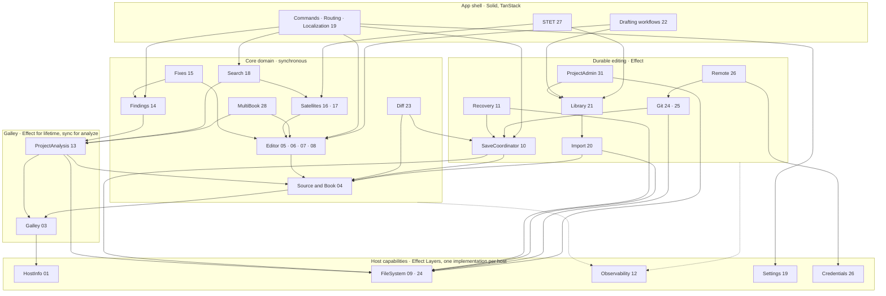

# Sefer v2: module DAG and service shapes

Status: idea for discussion, prepared 2026-09-06 from the 31 slices. It authorizes nothing; it is the slices seen at a glance as modules, their dependency direction, and the few methods each would need. Names are placeholders. Where a box is an Effect service it owns a lifetime, asynchrony or a host capability; everything else is synchronous code that Effect programs call.

## The rule that shapes the graph

Effect at the edges: host capabilities, engine lifetime, I/O, Git, observability. The editor interaction path (admission → analysis → mutation → publication) is synchronous and never a fiber. Arrows point at dependencies; nothing points at the app shell, and core never points at a host.

Dotted edges: every module emits spans and verdicts to Observability; nothing reads from it except the devtools surface.

## Service shapes

Each row: what the module owns, the handful of operations it must expose, and whether it is an Effect service (owns lifetime, asynchrony or a host capability) or synchronous core.

| module | slices | kind | owns | operations (sketch) |
|---|---|---|---|---|
| HostInfo | 01 | Layer | host kind, build identity, app paths | `kind`, `build`, `paths` |
| FileSystem | 09, 24 | Layer per host; the port is `effect/FileSystem` (Effect 4 core), implementations: Node (tests, tooling), Tauri fs plugin, Web OPFS also exposing the Node-shaped `fs` isomorphic-git needs | bytes on disk or in Web storage, atomic replace, listing, watching | `read(path)`, `writeAtomic(path, bytes)`, `list(dir)`, `stat`, `watch(dir) → Stream`, `remove` |
| Observability | 12 | Layer | bounded ring of events, spans, verdicts; JSONL export; devtools read surface | `span(name)`, `note(rule, verdict, detail)`, `recent()`, `export()` |
| Settings | 19 | Layer | persisted, schema-validated preferences | `get(key)`, `set(key, value)`, `changes → Stream` |
| Credentials | 26 | Layer per host | tokens for remotes, never in project files | `get(remote)`, `set`, `clear` |
| Galley | 03 | Layer for load, sync API | the pinned Scripture Kitchen WASM artifact (Galley = Onion parser + Sous proofreading, composed upstream), version acceptance, one `analyze` | `load() → scoped`, `version`, `analyze(text) → Analysis` (sync, one wants set: structure + diagnostics), `attrs` |
| ProjectAnalysis | 13 | Effect | Sefer's whole-project consumer of Galley: census of a project's books, cross-book results, freshness by stamp. Not resources (see Resources) | `census(project)`, `analyze(project) → per-book stamped products`, `fresh?(stamp)` |
| Source and Book | 04 | sync core, started (plain Book) | canonical UTF-8 text per book, `SourceStamp {revision, len, hash}`, book open/close | `open(bytes) → Book`, `book.text`, `book.stamp`, `book.apply(change) → stamp`, `subscribe`, `close` |
| Editor | 05–08 | sync core, CodeMirror area | mapping, registry, plan, owned index, phases, stops, views; the funnel and undo | `mount(book, projection)`, `dispatch(intent) → Verdict`, `undo/redo`, `view(mode)`, `stopAt(pos)` |
| Findings | 14 | sync core | one findings model over engine diagnostics and project checks, freshness against stamps | `list(book) → Finding[] @stamp`, `navigate(finding)`, `stale?(finding, stamp)` |
| Fixes | 15 | sync core | safe application of engine-produced edits through the funnel | `preview(finding) → Edit[] @stamp`, `apply(preview)` refused if stamp moved |
| Satellites | 16, 17 | sync core | read-only surfaces and editable windows over canonical content, clip, disposal | `openWindow(book, range, opts)`, `window.submit(change)`, `close` |
| Search | 18 | sync core | project find with stamped hits, one-match replacement | `find(query) → Hit[] @stamp`, `replace(hit)` refused if stale |
| MultiBook | 28 | sync core | one command across books, one history event per book, expiring immediate undo | `run(label, plan)`, `pendingUndo()`, `undoPending()` |
| Diff | 23 | sync core over Save's baseline | saved-vs-working comparison and chosen-hunk revert | `compare(book) → Hunks`, `revert(hunk)` |
| SaveCoordinator | 10 | Effect | persisted baseline per book, write receipts, external-change detection | `save(book) → Receipt {stamp, bytes hash}`, `baseline(book)`, `externalChanges → Stream` |
| Recovery | 11 | Effect | journal of unsaved work, restore on boot | `journal(book, change)`, `pending() → Restorable[]`, `restore(id)`, `discard(id)` |
| Resources · Import | 20 | Effect, schema started (`src/core/resources`) | staged, validated import with provenance | `stage(files) → Staged`, `classify(staged)`, `commit(staged) → Books` |
| Resources · Library | 21 | Effect, schema started (`src/core/resources`) | stable resource identities and project-role bindings | `resources()`, `bind(role, resource)`, `resolve(role)` |
| Git | 24, 25 | Layer per host (owner decision 2026-09-06: git2 in Rust behind Tauri commands on desktop; isomorphic-git over the Web FileSystem on Web) | repository lifecycle, commits, history, previous versions; the port is the intersection of user jobs, not either library's API; one contract suite runs against both | `init/open`, `commit(receipts)`, `log(book)`, `checkout(rev) → bytes`, `status` |
| Remote | 26 | Effect | approved online jobs | `attach(url)`, `push`, `pull`, `publish` |
| ProjectAdmin | 31 | Effect | rename, delete, metadata, export | `rename`, `delete`, `metadata`, `export(format)` |
| Shell | 19 | Solid app | commands, routing, localization, settings UI | `command(name)`, routes, `t(message)` |
| Drafting, STET | 22, 27 | app workflows | translator jobs composed from the above | per job |

## Reading the graph against the slices

- The gates map onto columns: editor foundation (A) is the Core column with Galley; satellite correctness (B) is Satellites and Search; engine integration (C) is Galley, ProjectAnalysis, Findings, Fixes; durable editing (D) is the Durable column.
- Only five modules are host-specific Layers. Everything in Core is testable in Node against the real engine and real CodeMirror state; everything in Durable is testable against a temporary directory or isolated Web storage.
- `SourceStamp` is the one type every arrow into Findings, Fixes, Search, Save, Recovery and Diff carries. It is the freshness contract; no module trusts a length.
- Nothing here needs a service registry. Composition roots (Web, Tauri) provide the five host Layers and the Galley Layer; the rest is constructed from them.

## Names

Upstream naming, so the adapter says what it wraps: **Onion** is the USFM parser, **Sous** the proofreading, **Galley** the composed engine over both, and **Scripture Kitchen** the cargo workspace that bundles them into the WASM artifact Sefer pins. Sefer's adapter is therefore `Galley`. `ProjectAnalysis` is Sefer's own whole-project consumer of Galley and is not the Scripture Burrito / Resource Container layer; that is `Resources` (Import and Library, slices 20–21).

## Open

CSS and UI kit are undecided and do not appear here. Localization is a Shell concern; the only scaffolding it needs before a real screen is that strings pass through one function. Whether Settings is a Layer or plain persisted state under FileSystem is undecided until the first preference exists.
