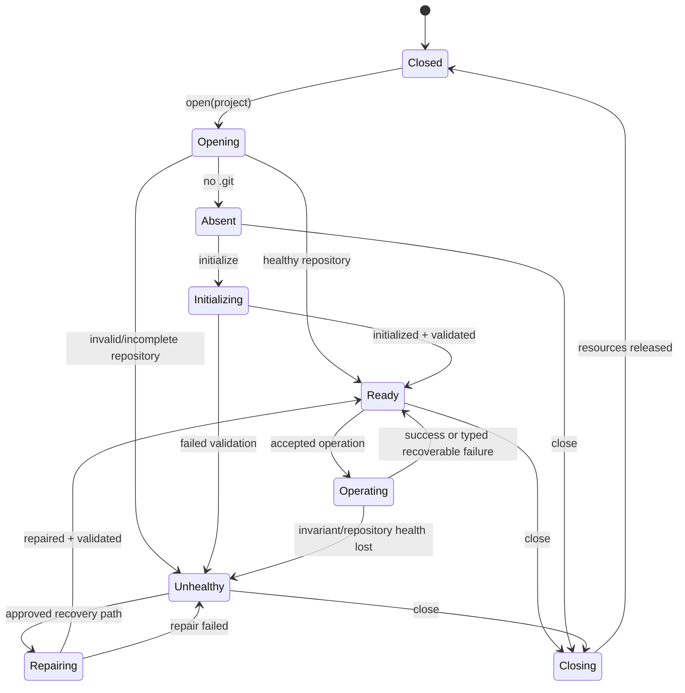

# Isomorphic Git, Effect filesystem, and traced repository lifecycle

- **Status:** discussing; decisions and probes remain open
- **Scope:** the Sefer-owned filesystem boundary, isomorphic-git hosting on Web and Tauri, repository lifecycle, and correlated observability
- **Does not authorize:** dependency installation, filesystem implementation, Git migration, or application feature work
- **Related plans:** [`../00-ideas/local-observability-and-agent-evidence.md`](../00-ideas/local-observability-and-agent-evidence.md), [`../00-ideas/nearly-no-mocks-testing.md`](../00-ideas/nearly-no-mocks-testing.md)

## Problem and intended result

Sefer needs the same Git behavior on Web and desktop while keeping project files durable in the platform-appropriate store:

- Web projects and repositories live in OPFS.
- Tauri projects and repositories live as real files on persistent native disk, within explicitly authorized roots.
- isomorphic-git runs in TypeScript and requires a Node-like filesystem interface, principally `fs.promises` operations.
- application I/O should use Effect for typed errors, lifecycle, cancellation, service composition, logging, and tracing.
- CodeMirror and synchronous Galley work remain within the interaction frame; Git and filesystem I/O are outside that hot path.

The desired result is one filesystem implementation per platform, adapted upward into domain services and sideways into isomorphic-git and file logging. Avoid a second mirrored Git filesystem, duplicate Web/Tauri Git semantics, and parallel application logging APIs.

## Evidence from v1

`scripture-editor-proto-2` currently has a shared application `FileSystem`, an OPFS implementation, and a Tauri implementation backed by `@tauri-apps/plugin-fs`. Its Web Git provider uses isomorphic-git with a separate OPFS-compatible Git filesystem. Desktop Git uses a separate Rust/git2 provider.

That proves the product needs both application filesystem semantics and Git filesystem semantics. It also shows the duplication Sefer may remove. It does not prove that isomorphic-git over Tauri filesystem IPC is fast enough or that Effect's full `FileSystem` contract maps faithfully to both hosts.

## Proposed ownership

### Domain services remain application-facing

Application operations depend on narrow services such as:

- `BookRepository` for exact source reads and revision-bound saves;
- `RecoveryStore` for backup/recovery policy;
- `ProjectRepository` or `ProjectDiscovery` for managed projects;
- `GitRepository` for history, checkpoints, restore, and remote operations;
- `DiagnosticLogStore` for local evidence persistence.

These services express product guarantees such as exact bytes, atomic replacement, captured-revision receipts, managed roots, external-change detection, and typed outcomes. UI and editor code do not issue generic filesystem calls.

### One real filesystem capability per platform

Below those services, investigate an Effect `FileSystem` implementation for each host:

```text
Effect FileSystem
├── Web: OPFS implementation
└── Tauri: @tauri-apps/plugin-fs implementation → native persistent disk
```

Effect is an interface and lifecycle; it does not choose Web storage. The Tauri Layer must use native platform paths supplied by the host and enforce capability-scoped managed roots. Project source and `.git` data must not be stored in localStorage, IndexedDB, an in-memory mirror, or a second synchronization cache on desktop.

Before adopting the full interface, inventory the union required by domain services, isomorphic-git, and `PlatformLogger`. Implement Effect `FileSystem` only if both platforms can honor its claimed semantics. If the union is materially narrower or several methods would be misleadingly unsupported, define a smaller Sefer-owned filesystem service and adapt that instead.

### isomorphic-git compatibility adapter

isomorphic-git does not consume Effect `FileSystem` directly. Provide a narrow Node-like compatibility adapter over the selected filesystem service:

```text
GitRepository
  → isomorphic-git
    → IsomorphicGitFsAdapter (`fs.promises` shape)
      → one managed Effect runtime
        → platform filesystem Layer
```

Use one long-lived, scoped runtime for adapter calls. Do not create a runtime per filesystem operation. Implement only the filesystem surface required by the pinned isomorphic-git version, but implement each advertised operation faithfully, including its error codes and byte/string behavior.

The adapter owns compatibility translation. isomorphic-git-specific error vocabulary and Node-shaped results must not leak into domain services.

### Logging uses the same infrastructure when earned

Frontend code uses Effect Logger and Effect spans. If the platform filesystem Layer already exists and the probe succeeds, `PlatformLogger.toFile` may write frontend JSONL through it. This is no longer a reason by itself to create a filesystem abstraction; it is a possible additional consumer.

`tauri-plugin-log` remains a candidate for Rust, plugin, startup, and panic logging. Do not call it alongside Effect Logger as a second frontend API. Initially prefer separate frontend and native files with compatible correlation fields over concurrent writers to one file.

## Repository lifecycle state machine

The Git host is a state machine, not a bag of callable methods. A repository must be opened, inspected, initialized or validated, operated on, and closed under explicit ownership. Transitions run as Effect programs and emit correlated spans and structured state-transition events.



### State meaning

- `Closed`: no repository handle/runtime ownership for the project.
- `Opening`: roots, permissions, filesystem capability, and repository presence are being established.
- `Absent`: managed project exists but no repository has been initialized.
- `Initializing`: repository creation and initial validation are in progress.
- `Ready`: repository passed the required health check and may accept operations.
- `Operating`: an accepted Git operation owns the mutation slot; the operation kind is data, not another top-level state.
- `Unhealthy`: repository invariants failed or an interrupted/incomplete state requires an explicit disposition.
- `Repairing`: a named, conservative recovery action is running.
- `Closing`: pending owned work is settled or interrupted according to policy and resources are released.

Clean/dirty working-tree status, current branch, detached HEAD, and local/remote relationships are observed repository facts. Do not multiply lifecycle states into combinations such as `ReadyDirtyAhead`. Attach those facts to `Ready`, operation results, and telemetry.

### Transition rules

- Reject illegal operations with a typed error containing current state and requested operation.
- Serialize repository mutations. Decide by measurement and library guarantees whether safe reads may overlap; default to serialization until proven.
- Bind every operation to repository ID, application instance, operation ID, and optional verification run ID.
- Do not silently reinitialize an unhealthy repository or delete `.git`. Recovery is a distinct transition with a named policy and evidence.
- Cancellation must have explicit semantics for each mutation. Do not claim interruption safety where isomorphic-git or the filesystem cannot provide it.
- A recoverable transport/auth error returns to `Ready` if local health remains valid. A failed health invariant transitions to `Unhealthy`.
- Close owns its fibers, buffers, handles, and final bounded telemetry flush; it never waits without a deadline for optional export.

## Tracing model

Create one root span for each accepted lifecycle transition or Git operation, not for each low-level filesystem call by default. Candidate span names:

- `git.repository.open`
- `git.repository.initialize`
- `git.repository.validate`
- `git.operation.status`
- `git.operation.commit`
- `git.operation.history`
- `git.operation.restore`
- `git.remote.inspect`
- `git.remote.fetch`
- `git.remote.push`
- `git.repository.repair`
- `git.repository.close`

Attach safe attributes: repository identity opaque to logs, lifecycle before/after, operation ID, branch when safe, changed-file count, object/byte counts, result category, filesystem platform, and duration. Do not record repository paths, remote credentials, manuscript text, commit diffs, or arbitrary errors.

Emit state transitions as structured events within or correlated to the operation span:

```text
git.lifecycle.transition
  from=Opening
  to=Ready
  reason=healthy
  operationId=...
```

Low-level filesystem spans are diagnostic escalation. At `trace`, aggregate counts and timings by operation (`read`, `write`, `stat`, `readdir`, `rename`) first. Add individual calls only within a bounded verification capture because isomorphic-git may generate high volume. The instrumentation path must not materially amplify IPC traffic.

Trace context crosses the Promise-shaped isomorphic-git adapter through the managed Effect runtime. Across Tauri filesystem IPC, start with operation ID/run ID propagation. Add full trace-context headers/fields only if Rust-side spans justify them.

## Tauri persistence constraints

- Project source and `.git` objects live on real persistent native disk.
- Tauri capabilities restrict access to explicit project, application-data, cache, temporary, and log roots.
- Public application paths do not silently become unrestricted absolute filesystem authority.
- Atomic save/recovery replacement remains an explicit domain guarantee; generic `rename` or `writeFile` does not establish it across every platform.
- The application must distinguish user project storage from cache, temporary files, recovery, and logs.
- A desktop Git operation must not depend on OPFS, browser local storage, or a later mirror-to-disk step.

## Nearly-no-mocks verification

Use real isomorphic-git and real filesystem implementations:

- Web contract and Git tests use isolated OPFS/browser storage.
- Desktop integration uses a temporary native directory inside an allowed test root and the real Tauri filesystem path.
- Node-level adapter tests use Effect's real Node filesystem with temporary directories where compatibility permits.
- A small committed repository fixture establishes known branches/history without fabricating Git results.
- Lifecycle tests run the real Effect state machine and assert state, typed result, repository bytes/refs, and telemetry.

Use a controllable filesystem implementation only for named failures that cannot be induced safely or portably, such as completion reordering or disk-full. It must satisfy the shared filesystem contract and must not replace real Web/Tauri vertical slices.

## Required comparison probe

Before adopting isomorphic-git for desktop, compare a representative native-disk repository through the Tauri filesystem adapter. Record cold and warm results for:

1. open and health validation;
2. initialization;
3. status after editing one book;
4. commit of representative changed files;
5. paginated history;
6. historical tree/read;
7. restore/checkout behavior;
8. reopen after application restart;
9. clone, fetch, and push if remote Git is in the selected slice.

For each, record duration, number and type of filesystem operations, IPC calls, bytes, maximum synchronous main-thread work, and trace volume. Use ordinary and larger representative repositories. Compare with the current native Git approach only if measurements put the isomorphic path near a user-visible threshold; do not build two production implementations preemptively.

### Acceptance direction

Accept the shared isomorphic-git path when it preserves repository correctness and expected filesystem semantics, stays outside the editor/Galley frame, and produces acceptable user-visible latency without a mirrored filesystem or broad cache protocol.

If it is too chatty, first investigate bounded changes at the existing seams: avoiding duplicate status calls, operation-scoped metadata reuse, or a proven batch primitive. Do not introduce a second authoritative filesystem. If the measured gap remains unacceptable, return to owner adjudication between native desktop Git and a coarser native Git command boundary.

## Implementation slices after approval

1. Pin candidate Effect and isomorphic-git versions; record exact filesystem contracts from their declarations.
2. Inventory required filesystem operations and semantic mismatches across Effect, isomorphic-git, OPFS, and Tauri.
3. Decide full Effect `FileSystem` versus a smaller Sefer filesystem service.
4. Implement one platform filesystem Layer and shared behavioral contract using real temporary storage.
5. Implement the Promise-shaped isomorphic-git adapter over one managed Effect runtime.
6. Implement the repository lifecycle state machine and transition tracing around a local-only Git slice.
7. Implement the other platform Layer and run the same contracts.
8. Run the desktop IPC comparison gate before committing to isomorphic-git as the desktop provider.
9. Add remote operations only after local lifecycle, persistence, and performance are accepted.
10. Evaluate `PlatformLogger.toFile` as an additional filesystem consumer; keep native logging separately owned.

Each slice must remain reviewable and leave working evidence. Do not scaffold all interfaces before the first real vertical operation proves their shape.

## Open questions requiring owner discussion

### Filesystem contract

- Does the required operation union justify implementing full Effect `FileSystem` on both platforms?
- Which Effect methods cannot be given honest OPFS or Tauri semantics?
- What exact Node-style methods and error codes does the pinned isomorphic-git version exercise?
- Who owns path normalization and managed-root authorization: platform Layer, domain service, or both at distinct levels?
- How are external user-selected folders represented without leaking raw path authority throughout the app?

### Lifecycle and concurrency

- Is there one lifecycle machine per open project, or a bounded repository manager owning machines for multiple projects?
- Which reads, if any, may overlap a mutation safely?
- What does close do with a commit/fetch/push in progress?
- Which failures prove repository unhealthiness versus an operation-specific typed failure?
- What repair operations are safe enough to automate, and which require explicit user choice?
- Is working-tree status refreshed on demand, after known mutations, or both?

### Persistence and performance

- Is Tauri plugin-fs IPC fast enough for isomorphic-git's actual filesystem access pattern?
- Can operation-level caching reduce redundant reads without becoming another source of truth?
- Are packfiles, large history, and Windows rename/locking behavior acceptable through the adapter?
- Does browser/Tauri memory use remain bounded on representative repositories?

### Git parity

- Must Web and Tauri share identical Git implementation, or is behavioral parity through a shared `GitRepository` contract sufficient if the performance gate fails?
- Which v1 Git behaviors remain product requirements: hidden checkpoints, previous versions, restore, remote relationships, rebase/replay, and author metadata?
- Which operations belong in the initial Sefer slice versus later remote capability work?

### Observability

- Which lifecycle transitions are useful at `info`, and which operation/file aggregates belong at `debug` or `trace`?
- Can trace context survive the isomorphic-git Promise adapter without accidental detached spans?
- When does individual filesystem-call tracing become necessary, and how is it bounded?
- Can frontend Git traces and Rust native logs correlate through operation ID without full OpenTelemetry propagation?

### Logging

- Does an existing filesystem Layer make `PlatformLogger.toFile` sufficient for frontend JSONL?
- How are rotation, age/count cleanup, and crash-tail loss handled without coupling logs to project storage?
- Should Rust logs remain in a separate file and merge only in evidence queries/OTLP?

## Non-goals

- running Git, filesystem I/O, or logging inside the CodeMirror/Galley synchronous frame;
- treating Effect `FileSystem` as the domain model;
- storing desktop projects in browser storage;
- mirroring an in-memory Git filesystem to disk;
- implementing both native and isomorphic desktop Git before the performance gate;
- exposing arbitrary filesystem access to application features;
- tracing every filesystem call at normal production volume;
- automatic destructive repository repair;
- using telemetry as repository, recovery, or save authority;
- adding PubSub solely to report lifecycle state.

## References

- [Effect FileSystem](https://effect.website/docs/v4/platform/file-system)
- [Effect PlatformLogger](https://effect.website/docs/v4/platform/platformlogger)
- [isomorphic-git filesystem documentation](https://isomorphic-git.org/docs/en/fs)
- [Tauri filesystem plugin](https://v2.tauri.app/plugin/file-system/)
